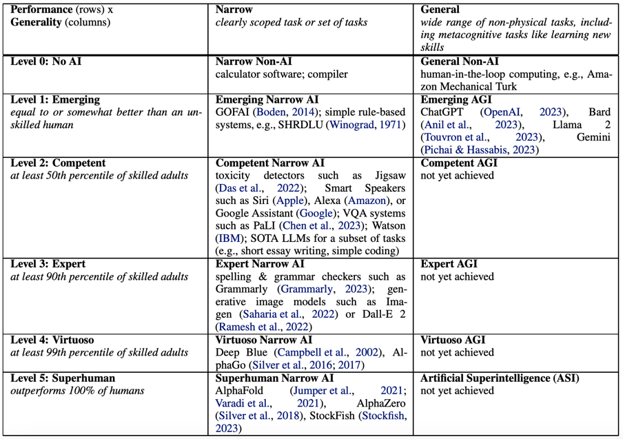
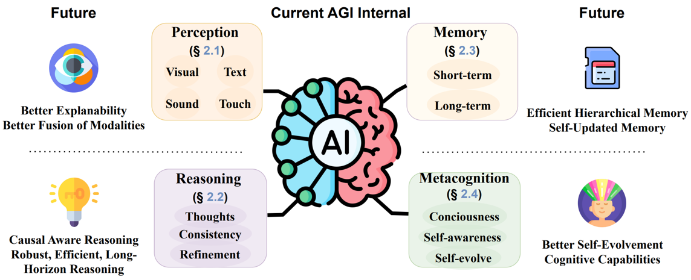
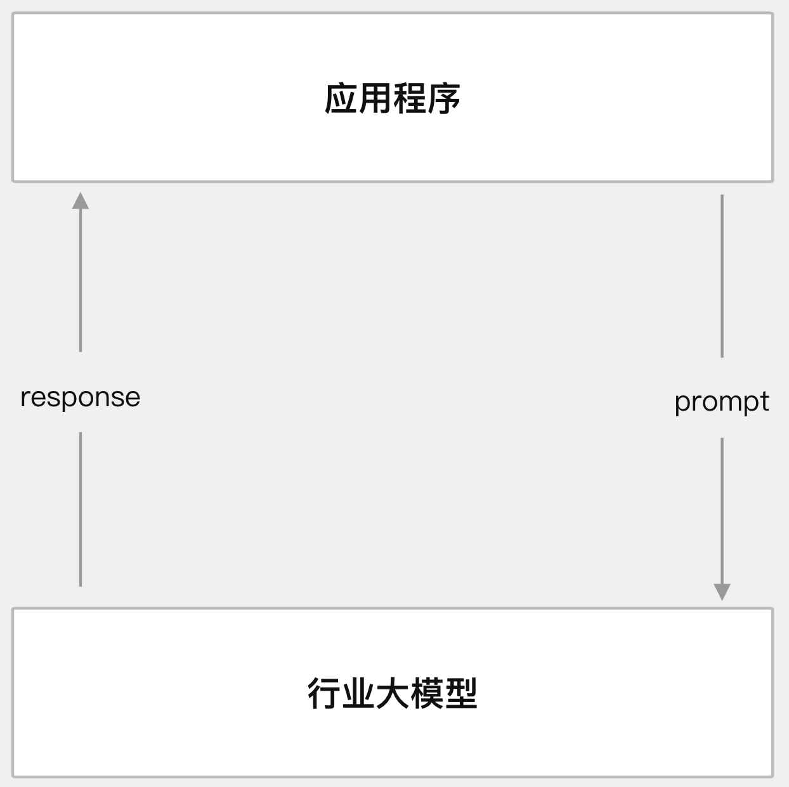
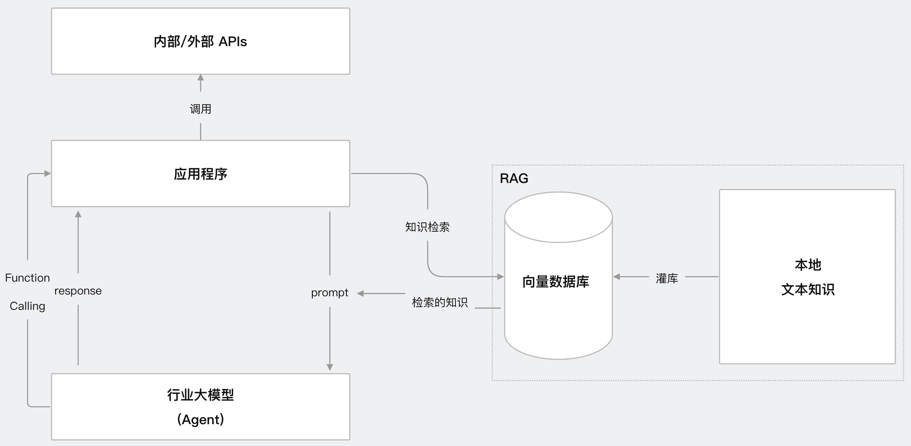
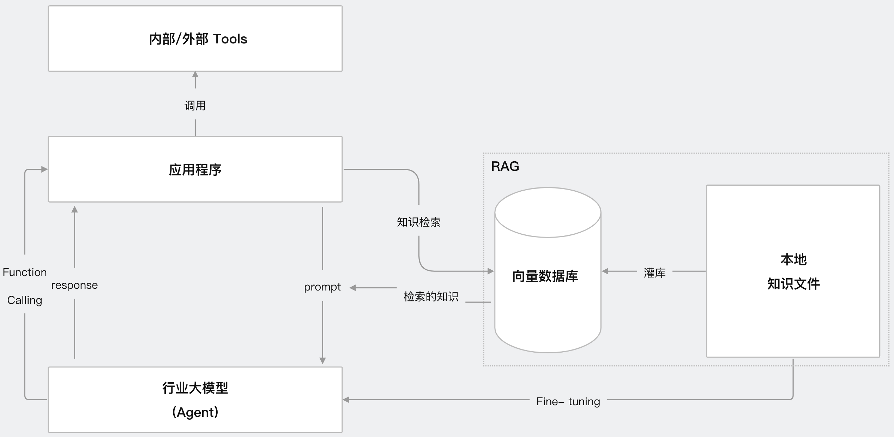
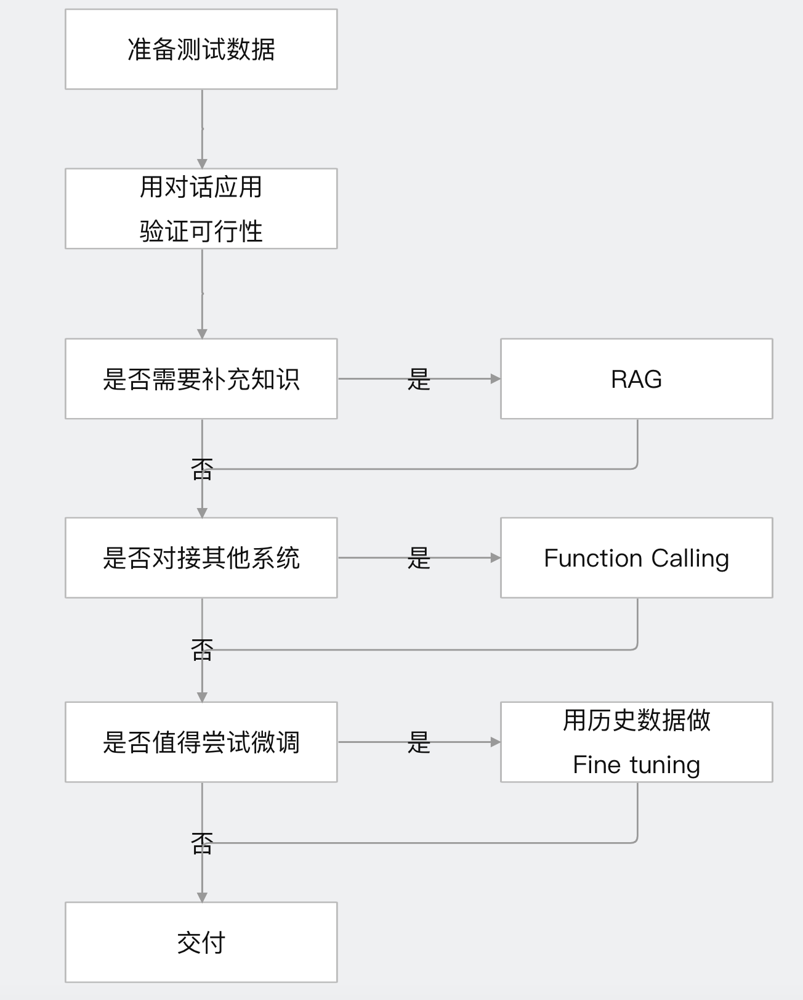

# AGI知识体系介绍   
## 1、AI，什么是AI 
主流观点:基于机器学习、神经网络是AI，基于规则、搜索的不是AI                               
用好AI的核心心法:**把AI当人看。指令具体、信息丰富、尽量少歧义**                              

## 2、AGI是什么
AGI，全称是Artificial General Intelligence 通用人工智能                         
**(1)Google DeepMind在2024年6月份发表了一篇文章，对AGI的不同层次做了一些定义**             
《Position:Levels of AGI for Operationalizing Progress on the Path to AGI》        
论文链接:https://arxiv.org/pdf/2311.02462           
这张图表展示了一个AI能力分级的框架，基于AI在特定任务中的表现与人类能力的对比                 
图表分为两列：Narrow AI（狭义AI） 和 General AI（通用AI，AGI）              
Narrow AI：专注于特定任务的AI，任务范围明确              
General AI：能够处理广泛非物理任务的AI，包括学习新技能的能力                  
**Level0:** No AI，依赖人类或简单的规则系统，属于传统工具或服务                 
**Level1:** 初现，AI能力等于或略优于未受过训练的人类                               
**Level2:** 胜任，AI能力达到熟练人类中50%的水平，也就是超过50%的拥有技能的人                   
**Level3:** 专家，AI能力达到熟练人类中90%的水平，也就是超过90%的拥有技能的人          
**Level4:** 大师，AI能力达到熟练人类中99%的水平，也就是超过99%的拥有技能的人          
**Level5:** 超人类，超过100%的人类                      
    
**(2)AGI需要具备的能力:**                       
2024年10月份在Transactions on Machine Learning Research学术期刊上发表了一篇文章《How Are We From AGI:Are LLMs All We Need?》             
论文链接:https://arxiv.org/pdf/2405.10313             
**Perception(感知):** Visual（视觉）、Text（文本）、Sound（声音）、Touch（触觉）            
**Memory(记忆):** Short-term（短期）、Long-term（长期）                    
**Reasoning(推理):** Thoughts（生成想法）、Consistency（保持逻辑一致性）、Refinement（从经验中提炼智慧）                     
**Metacognition(元认知):** 指的是“对自己认知过程的认知”，是AGI接近人类智能的高级特征。Conciousness(思想意识)、Self-awareness(自我认知)、Self-evolve(自我进化)               
         

## 3、AGI时代，新的社会分层 
**(1)AI使用者（人人都是，不稀缺）**                           
类比移动互联网，就像每个人用智能手机刷微信、看视频。你不需要懂技术，下载个App就会用             
AI也是一样，普通人用聊天机器人、语音助手，或者修图软件里的AI滤镜，门槛低，谁都能上手                      
**(2)AI产品开发者**                  
类比移动互联网，就像开发微信、抖音的程序员团队。他们不造手机，也不设计芯片，但会用现成的工具（比如安卓系统）做出好用的App              
AI产品开发者类似，拿现成的基础模型（比如开源的语言模型），调一调，做个客服机器人或推荐系统，技术门槛中等                      
**(3)基础模型相关（门槛高、机遇难）**                      
类比移动互联网，就像造手机芯片（比如高通、苹果系列）或开发安卓、iOS系统的公司。这些是核心技术，投入大、难度高，只有少数巨头能玩                  
AI就是搞基础模型的，比如开发GPT、LLaMA这样的大模型，需要海量数据、算力和顶尖人才，普通人或小公司很难挤进去                     

## 4、AGI核心能力模型 
努力做3懂人才              
**(1)懂业务:懂用户、客户、需求、市场、运营、商业模式**                      
懂用户，知道目标用户是谁，他们的习惯和痛点                                 
懂客户，明白付钱的人（可能是老板或公司）想要什么                      
懂需求，能分清什么是用户真想要的                       
懂市场，了解行业趋势，比如AI客服现在火，未来可能是AI医疗                      
懂运营，知道AI产品上线后怎么推广、留住用户                   
懂商业模式，清楚怎么赚钱，比如按月收费、卖数据分析服务还是免费引流再卖广告                           
**(2)懂AI:知道AI能做什么，不能做什么，怎样做更快、更好、更便宜**                    
知道AI能做什么，明白AI擅长的，比如认图、写文、预测销量，不玄乎也不吹牛                        
知道AI不能做什么，清楚AI的局限，比如没法完全代替人做创意设计或处理复杂感情                    
怎样做更快，懂得用现成工具或模型，比如拿开源代码改改就能用，不用从头训练                       
怎样做更好，会调参数、选对数据，让AI结果更准，比如客服机器人别答得驴唇不对马嘴                         
怎样做更便宜，能省资源，比如用小模型跑简单任务，不浪费算力                         
**(3)懂编程:实现一个符合业务需求的产品**                 
实现一个符合业务需求的产品，会写代码把想法落地。比如，客户要个销售预测工具，你能用Python写个程序，接上AI模型，吐出结果给老板看。还得简单好用，别让用户学半天                   

## 5、目前AGI行业共识
2个确定、1个不确定                   
(1)确定未来:AI必然重构世界                        
(2)确定进入:想获取红利，必须马上进入                      
(3)不确定落地:解决什么问题，用什么技术路线，产品策略是什么，确定性都不高                            

## 6、AGI场景落地思路
(1)从最熟悉的领域入手               
(2)找“文本进、文本出”的场景                    
(3)别求大而全。将任务拆解。先解决任务小场景                 
(4)让AI学最厉害员工的能力，辅助其他员工，降本增效                

## 7、LLM是什么及如何生成结果
LLM(Large Language Model)，大语言模型是人工智能领域的一种技术          
基于深度学习（特别是神经网络中的Transformer架构），通过在海量文本数据上训练，能够理解和生成自然语言的AI系统            
那LLM如何生成结果              
通俗原理:其实，TA只是根据上下文，猜下一个词(的概率)                 
略深点的通俗原理:训练和推理是大模型工作的两个核心过程(用人类比，训练就是学，推理就是用。学以致用)              
用不严密但通俗的语言描述训练和推理:                     
**(1)训练**                                 
大模型阅读了人类说过的所有话。这就是机器学习                   
训练过程会把说过的话中的不同token同时出现的概率存入神经网络文件，保存的数据就是参数，也叫权重                     
LLM通常有几十亿到上千亿个参数（parameters），这些参数是通过训练调整的，决定了模型对语言的理解和生成能力。比如，像DeepSeek-R1有671B个参数          
**(2)推理**                                     
给推理程序若干token(prompt)，程序会加载大模型权重算出概率最高的下一个token是什么                  
用生成的token再加上上下文，就能继续生成下一个token                       

## 8、token是什么
在LLM中，Token 是文本处理的基本单位，不是简单的“单词”或“字符”，而是经过 Tokenizer（分词器） 处理后的一段文本片段             
Token 的长度和内容取决于具体的分词策略和模型设计               
prompt的单位            
(1)可能是一个英文单词，也可能是半个，三分之一个                        
(2)可能是一个中文词或一个汉字、半个汉字、甚至三分之一汉字                                                 
(3)大模型在开训前，需要先训练一个tokenizer模型，将所有文本切成token                                                  

## 9、LLM生成机制的内核        
深度学习模型架构:Transformer、RWKV、Mamba                           
其中Transformer架构，仍是主流，但已经不是最先进的了，谷歌开源、最流行，几乎所有大模型都用它                                    
**Transformer**               
是由谷歌在2017年提出的架构（论文《Attention is All You Need》），彻底改变了自然语言处理（NLP）领域。它放弃了传统的循环神经网络（RNN），转而使用 **自注意力机制（Self-Attention）** 来并行处理序列数据                    
**RWKV（Recurrent Weighted Key-Value）**                  
是一种较新的架构，结合了 RNN 和 Transformer 的优点，试图解决 Transformer 的效率问题。它由社区驱动开发（非谷歌主导），近年来受到关注                
**Mamba**                
是2023-2024年间提出的新型架构，旨在取代 Transformer，尤其针对长序列和高效率需求。它基于结构化状态空间模型（Structured State Space Models, SSM）            
目前只有Transformer被证明了符合scaling-law。RWKV 和 Mamba 的 Scaling Law 研究还在进行中，初步结果显示它们可能也符合类似规律，但数据和实验规模还不足以媲美 Transformer 的成熟验证                                      
**什么是Scaling Law？**                   
Scaling Law 是深度学习领域的一种经验规律（由 OpenAI 等研究提出），表明模型性能（比如语言理解能力）会随着三个因素的增加而提升                             
模型参数量（更大的网络）               
训练数据量（更多文本）                
计算资源（更多算力）                  

## 10、LLM应用业务架构 
(1)AI Embedded模式，人主导，中间某个环节AI参与，如人脸识别                    
(2)AI Copilot模式，AI和人主导，每个环节AI辅助参与                    
(3)AI Agent模式，人把事情丢给AI，AI自己规划自己去做                      
目前，Agent还太超前，Copilot值得追求                           

## 11、LLM应用技术架构
4种主流技术架构，应用技术特点:门槛低、天花板高                  
**(1)指令工程  Prompt Engineering**                          
使用场景:知识问答、情报分析、写作、编程、文本加工等        
核心思想:构造一个有效且正确的prompt:指令具体、信息丰富、尽量少歧义             
技术架构图如下:    
                
**(2)给大模型新知识  RAG**                              
使用场景:智能知识库、智能诊断、数字分身、带例子的prompt等                    
核心思想:人找知识，会查资料；LLM找知识，会查向量数据库(向量检索即相似度检索)                               
技术架构图如下:                   
         
此时，prompt会带着问题和知识交给大模型，大模型基于知识进行总结反馈给应用程序            
**(3)让大模型对接外界   Function Calling**                                
使用场景:智能助手，下一代搜索引擎、机器人、Agent等                                    
基本过程:大模型调用内外部工具处理问题               
Agent使用json格式反向提出要求，应用了大模型的规则性原理            
技术架构图如下:         
               
**(4)让大模型深度理解知识  Fine-tuning**                                      
使用场景:智能知识库、智能诊断、数字分身等                                    
核心思想:人阅读背诵，理解资料；LLM进行增强学习训练                  
基本过程:给基础大模型增加参数(补充垂直领域的新知识)，基于大模型进行轻量化微调。Fine-tuning全过程都在使用工具(不需要重新造轮子)                           
技术架构图如下:      
                
与RAG解决的场景类似，差别:                        
RAG查询完资料就会忘记，下次需要重新再查                        
微调后的垂直领域行业大模型(Fine-tuning)是将知识记住，可立即给结果                        
类比:一场开卷考试两种方案                    
方式1:RAG会查资料，节省算力，耗时稍长                                     
方式2:Fine-tuning要记住资料，消耗一定算力，即时反馈                                        

## 12、如何选择技术路线
面对一个需求如何开始，如何选择技术方案。常用思路如下:             
               
前两步是最重要的，耗时最高            
值得尝试Fine-tuning的情况:              
(1)提高模型输出的稳定性               
(2)用户量大，降低推理成本的意义很大         
(3)提高大模型的生成速度           
(4)需要私有化部署               
