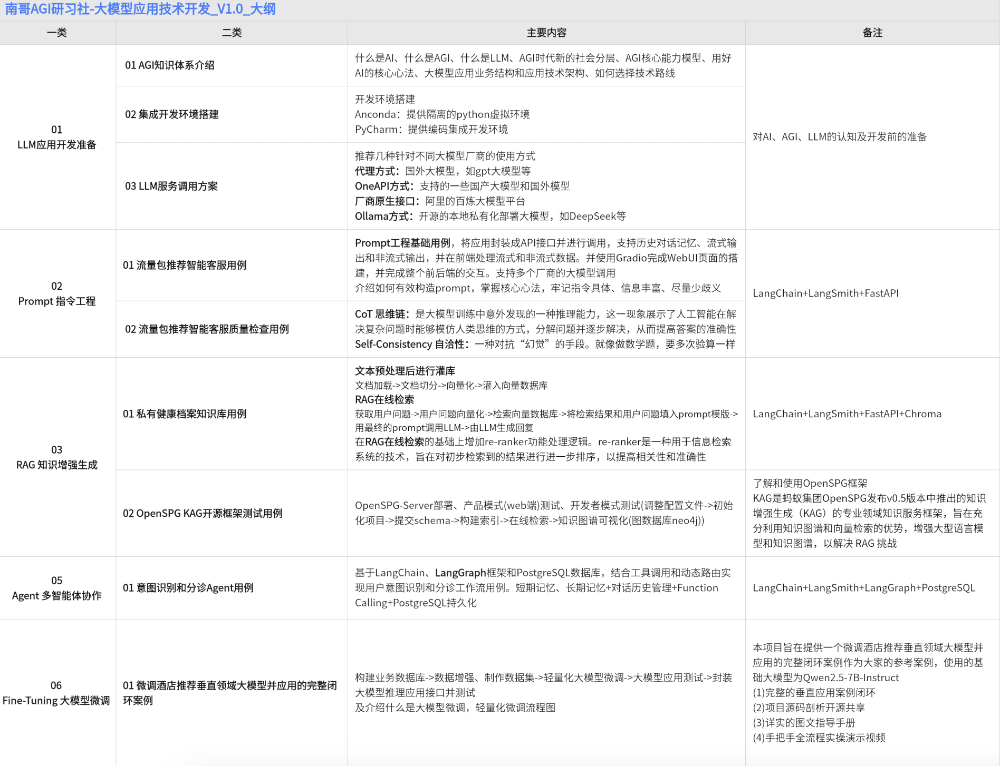

# 南哥AGI研习社-入门系列   
## 大模型应用技术开发          
                      

相关视频合集整理:              
【大模型应用开发-入门系列】01 一次梳理大模型入门学习路径                 
https://youtu.be/RKYKr3BABhc                 
https://www.bilibili.com/video/BV1YMfuYvEUQ/                    
【大模型应用开发-入门系列】02 AGI知识体系介绍-开发前认知扫盲          
https://youtu.be/NQE2dwH9WvE                   
https://www.bilibili.com/video/BV1t5dnYJE28/                
对应文件夹:01_BasicIntro/01_AGI知识体系介绍        
【大模型应用开发-入门系列】03 集成开发环境搭建-开发前准备工作            
https://youtu.be/KyfGduq5d7w           

大纲_V1.0内容                                   
              

          

